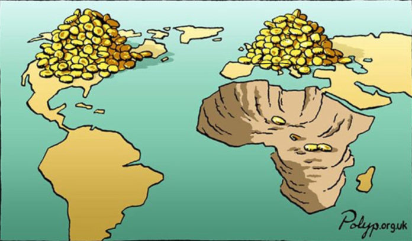

## Race, Class, Colonialism, and the World Cup

<div style='float: right; margin: auto; padding: 5px;'>
<figure>

<figcaption><a href='https://revolutionsocialist.ng/africa-a-continent-rattled-by-coups-poverty-inflation-and-debt/' target='_blank'>Image Source</a></figcaption>
</figure>
</div>

I've always found it fascinating how incisively fans and researchers of "global" sports (soccer, cricket, rugby) are able to dissect and discuss the inherent class, race, and ethnic dynamics, whether "formally" in books like @kuper_soccernomics_2018 or informally in discussions about various professional leagues.

To me this is in stark contrast to more North America-centric sports—American football, baseball, or basketball—where these dynamics only seem to "suddenly" pop into the consciousness of fans in very rare cases (as in, maybe every 10 years or so):

* When labor politics and the structural inequalities between workers and employers suddenly intrude upon [entire seasons of pro sports leagues like the NFL](https://www.youtube.com/watch?v=ZymSrDfLhW8) due to players' union strikes, or
* When a unique individual athlete like [Colin Kaepernick](https://www.history.com/this-day-in-history/august-26/colin-kaepernick-kneels-during-national-anthem) rejects the keep-politics-out-of-sports ideology and forces an important national discussion on race (at great personal cost!)

And so, although the NFL and NBA are my go-to leagues on a year-to-year basis, every four years I find myself getting more and more wrapped up in the excitement of the FIFA World Cup... and I think I've maybe finally figured out why: the World Cup means that every four years we get to watch athletes from massively unequal backgrounds go head-to-head on at least the minimal basis of *shared rules*. Meaning, as I learn more and more international history, it becomes more and more exciting to watch, knowing the national-historical narratives "behind" the games.

## Colonizer vs. Colonized in the 2026 World Cup

[France defeating Senegal](https://www.fifa.com/en/match-centre/match/17/285023/289273/400021490) in this year's World Cup led me to deep-dive other tumultuous metropole-colony pairs. Among this year's matches so far, we have the following cases, where I've also included the ratio of per capita GDP between the metropole and former colony (from the full dataset you'll be able to browse below):

| GDP/Capita^[Data from the [World Bank](https://ourworldindata.org/grapher/gdp-per-capita-worldbank), 2024] | Colonizer | Result | Former Colony | GDP/Capita | GDPC Ratio |
| -:| -:|:-:|:- | -:|:-:|
| $54,799.00 | France | [3 - 1](https://www.fifa.com/en/match-centre/match/17/285023/289273/400021490) | Senegal | $4,461.00 | **12.28** |
| $61,006.00 | England | [0 - 0](https://www.fifa.com/en/match-centre/match/17/285023/289273/400021506) | Ghana (Gold Coast) | $7,056.00 | **8.65** |
| $48,460.00 | Spain | [1 - 0](https://www.fifa.com/en/match-centre/match/17/285023/289273/400021484) | Uruguay | $32,039.00 | **1.51** |

: {tbl-colwidths="[15,20,15,20,15,15]"}

There are also three additional... I don't know what to call them besides "corner cases":

* Apropos of England's [Round-of-16 match with Mexico](https://www.fifa.com/en/match-centre/match/17/285023/289288/400021531): in 1861 there was a [joint invasion and occupation of Veracruz, Mexico](https://www.nytimes.com/1861/12/05/archives/intervention-in-mexico-the-convention-between-england-france-and.html) by British, French, and Spanish troops
* Although it wasn't an "official" German colony, there *is* an... oddly-dark historical-colonial connection between Germany and Paraguay (who [eliminated Germany](https://www.fifa.com/en/match-centre/match/17/285023/289287/400021513) in the round of 32!) in the form of the [*Nueva Germania* settlement](https://en.wikipedia.org/wiki/Nueva_Germania), founded in the middle of Paraguay's Eastern province by Friedrich Nietzsche's sister in 1886 🤯
* There was also the [Dutch "Exit Island", Dejima](https://en.wikipedia.org/wiki/Dejima), apropos of the [2 - 2 Netherlands-Japan draw](https://www.fifa.com/en/match-centre/match/17/285023/289273/400021470)

Going back in time, it gets even more interesting:

* **Algeria** has never played **France** in a World cup... in fact, the one time they tried to play a friendly exhibition in 2001, fans in Paris [stormed the pitch](https://en.wikipedia.org/wiki/2001_France_v_Algeria_football_match), ending the game prematurely in the 76th minute
* **Angola**, however, *did* play against their former colonizers in **Portugal** in 2006, the sole World Cup that Angola has ever qualified for (they [lost 1-0](http://news.bbc.co.uk/sport2/hi/football/world_cup_2006/4852704.stm))
* **Morocco** lost to **France** in the semifinals of the [2022 World Cup](https://www.espn.com/soccer/match/_/gameId/633848/morocco-france)

## The Dataset

Here is my haphazardly-put-together spreadsheet, containing all of the matches thus far alongside the teams' GDPs per capita as in the table above:

* A **number of goals** and **country name** highlighted in [**yellow**]{style="background-color: #fff2cc;"} indicates the winning side^[For matches decided by penalties I just arbitrarily added 0.1 to the score of the winning team because... I don't know what I'm doing or what the "convention" is for that, if there is one!]
* A **GDP per capita** figure highlighted in [**yellow**]{style="background-color: #fff2cc;"}, on the other hand, indicates the **wealthier** side on this measure
* Then, cases where the **poorer team won** are highlighted in [**red**]{style="background-color: #f4cccc;"}, which thus indicates **"GDPC upsets"** where the richer country failed to convert their wealth into victory
* For these **"GDPC upsets"**, the **GDPC ratio** is highlighted in the same [**red**]{style="background-color: #f4cccc;"}
* The match data is then **sorted by** the **GDPC ratio**, so that we can see the most "surprising" upsets on the basis of national wealth!

<iframe src="https://docs.google.com/spreadsheets/d/e/2PACX-1vQjr3TbbfVBropSr9AAwfxnH7W1rMnmZ7Myjow-5ed1EKG8tgJsSmWjAeLNNElxuOVUDwVEtHVGgM3P/pubhtml?widget=true&amp;headers=false" style="width: 100%; height: 800px;"></iframe>

And, what we see is:

* The most surprising **draw** so far has been [**Portugal's 1 - 1 draw with DR Congo**](https://www.fifa.com/en/match-centre/match/17/285023/289273/400021502): Portugal's GDP per capita is more than **26 times greater** than the DRC's!
* The most surprising **defeat** has been [**Morocco over the Netherlands**](https://www.fifa.com/en/match-centre/match/17/285023/289287/400021522) on penalties in the Round of 32, with the Dutch GDP per capita being more than **7 times greater** than Morocco's

Then, if you [**download the data as `.csv`**](https://docs.google.com/spreadsheets/d/e/2PACX-1vQjr3TbbfVBropSr9AAwfxnH7W1rMnmZ7Myjow-5ed1EKG8tgJsSmWjAeLNNElxuOVUDwVEtHVGgM3P/pub?gid=0&single=true&output=csv) and sort it by the other two columns there, `gdpc_gap` and `mean_gdpc`, you will find that:

* The match with the **greatest absolute difference** in GDPs per capita was in fact **also an upset!** **Qatar**, with the highest GDPC out of all qualifying countries at $110,890.00, was [**defeated 3 - 1 by Bosnia**](https://www.fifa.com/en/match-centre/match/17/285023/289273/400021448), a country with a **$20,528.00** GDP per capita.
* The most "wealth-infused" match, by far, was Qatar's [**1 - 1 draw with Switzerland**](https://www.fifa.com/en/match-centre/match/17/285023/289273/400021447), with an average GDP per capita of **$96,588.00** between the two teams. This match was also coincidentally(?) played in San Francisco, California, the [**wealthiest city in the US by GDP per capita**](https://en.wikipedia.org/wiki/List_of_U.S._metropolitan_areas_by_GDP_per_capita)^[I'm using the general definition of 250,000+ people as a "city" here. Using all MSAs, San Francisco comes in second behind Midland, TX]
* At the opposite end of the spectrum, the "poorest" match in terms of mean GDP per capita between the two teams was [**Morocco's 4 - 2 defeat of Haiti**](https://www.fifa.com/en/match-centre/match/17/285023/289273/400021452), with Morocco's GDPC of $9,163.00 and Haiti's of $2,810.00 averaging out to **$5,986.50**.

## Capturing Within-Group Inequality with the Gini Coefficient

Finally, since GSheets also doesn't seem to allow embedding the country GDPs separated by group, here's that copied manually so you can explore both the **average wealth** and **degree of inequality** for each.

By looking at the **Gini Coefficient** for each group, you can see how this measure of inequality allows us to quantitatively "capture" properties we may have suspected intuitively:

* **Group I** emerges as the **most unequal** of the 12 groups, with wealthy **Norway and France** pitted against significantly-less-wealthy **Iraq and Senegal**, producing a coefficient of **0.463**
* **Group F** is the **most equal** of the groups, though this may be less easy to intuit: essentially, while Tunisia is somewhat of an outlier, the other three countries in this group are generally considered to be "wealthy, industrialized democracies"^[Tunisia is also a democracy, by my own understanding of the term, but if you don't think the [*Economist Democracy Index*](https://en.wikipedia.org/wiki/The_Economist_Democracy_Index) is silly (like I do), then you can instead call it a "Hybrid Regime".]

```{=html}
<style>
.group-table th, .group-table td {
  font-size: 0.9rem;
  padding-top: 0px;
  padding-bottom: 0px;
}
.grid-container {
  display: grid;
  grid-template-columns: 1fr 1fr; /* Two equal columns */
  gap: 20px; /* Space between columns */
}
</style>
<div class='grid-container'>

<table class="group-table" style="border-collapse: collapse;">
<thead>
</thead>
<tbody>

<!-- Group A -->

<tr style="border-bottom: none; padding-bottom: 0px; margin-bottom: 0px; background-color: #edcec2;">
  <td colspan="2" style="text-align: center; padding-bottom: 0px; margin-bottom: 0px; border-bottom: none;"><span data-qmd="**Group A**"></span></td>
</tr>
<tr style="border-top: none; background-color: #edcec2;">
  <td align="right"><span data-qmd="**Mean GDPC: $34,668.25**"></span></td>
  <td align="left"><span data-qmd="**Gini Coefficient: 0.271**"></span></td> 
</tr>
<tr>
  <td>South Korea</td>
  <td>$55,071.00</td>
</tr>
<tr>
  <td>Czechia</td>
  <td>$47,964.00</td>
</tr>
<tr>
  <td>Mexico</td>
  <td>$22,040.00</td>
</tr>
<tr>
  <td>South Africa</td>
  <td>$13,598.00</td>
</tr>
</tbody>
</table>

<!-- Group B -->

<table class="group-table" style="border-collapse: collapse;">
<thead>
</thead>
<tbody>
<tr style="border-bottom: none; padding-bottom: 0px; margin-bottom: 0px; background-color: #edcec2;">
  <td colspan="2" style="text-align: center; padding-bottom: 0px; margin-bottom: 0px; border-bottom: none;"><span data-qmd="**Group B**"></span></td>
</tr>
<tr style="background-color: #edcec2; border-top: none;">
  <td align="right"><span data-qmd="**Mean GDPC: $67,602.75**"></span></td>
  <td align="left"><span data-qmd="**Gini Coefficient: 0.274**"></span></td> 
</tr>
<tr>
  <td>Qatar</td>
  <td>$110,890.00</td>
</tr>
<tr>
  <td>Switzerland</td>
  <td>$82,286.00</td>
</tr>
<tr>
  <td>Canada</td>
  <td>$56,707.00</td>
</tr>
<tr>
  <td>Bosnia</td>
  <td>$20,528.00</td>
</tr>
</tbody>
</table>

<!-- Group C -->

<table class="group-table" style="border-collapse: collapse;">
<thead>
</thead>
<tbody>
<tr style="border-bottom: none; padding-bottom: 0px; margin-bottom: 0px; background-color: #edcec2;">
  <td colspan="2" style="text-align: center; padding-bottom: 0px; margin-bottom: 0px; border-bottom: none;"><span data-qmd="**Group C**"></span></td>
</tr>
<tr style="background-color: #edcec2; border-top: none;">
  <td align="right"><span data-qmd="**Mean GDPC: $19,293.00**"></span></td>
  <td align="left"><span data-qmd="**Gini Coefficient: 0.449**"></span></td> 
</tr>
<tr>
  <td>Scotland</td>
  <td>$45,547.00</td>
</tr>
<tr>
  <td>Brazil</td>
  <td>$19,652.00</td>
</tr>
<tr>
  <td>Morocco</td>
  <td>$9,163.00</td>
</tr>
<tr>
  <td>Haiti</td>
  <td>$2,810.00</td>
</tr>
</tbody>
</table>

<!-- Group D -->

<table class="group-table" style="border-collapse: collapse;">
<thead>
</thead>
<tbody>
<tr style="border-bottom: none; padding-bottom: 0px; margin-bottom: 0px; background-color: #edcec2;">
  <td colspan="2" style="text-align: center; padding-bottom: 0px; margin-bottom: 0px; border-bottom: none;"><span data-qmd="**Group D**"></span></td>
</tr>
<tr style="background-color: #edcec2; border-top: none;">
  <td align="right"><span data-qmd="**Mean GDPC: $47,060.75**"></span></td>
  <td align="left"><span data-qmd="**Gini Coefficient: 0.268**"></span></td> 
</tr>
<tr>
  <td>USA</td>
  <td>$75,489.00</td>
</tr>
<tr>
  <td>Australia</td>
  <td>$60,304.00</td>
</tr>
<tr>
  <td>Turkey</td>
  <td>$36,154.00</td>
</tr>
<tr>
  <td>Paraguay</td>
  <td>$16,296.00</td>
</tr>
</tbody>
</table>

<!-- Group E -->

<table class="group-table" style="border-collapse: collapse;">
<thead>
</thead>
<tbody>
<tr style="border-bottom: none; padding-bottom: 0px; margin-bottom: 0px; background-color: #edcec2;">
  <td colspan="2" style="text-align: center; padding-bottom: 0px; margin-bottom: 0px; border-bottom: none;"><span data-qmd="**Group E**"></span></td>
</tr>
<tr style="background-color: #edcec2; border-top: none;">
  <td align="right"><span data-qmd="**Mean GDPC: $26,114.75**"></span></td>
  <td align="left"><span data-qmd="**Gini Coefficient: 0.418**"></span></td> 
</tr>
<tr>
  <td>Germany</td>
  <td>$62,555.00</td>
</tr>
<tr>
  <td>Curaçao</td>
  <td>$21,218.00</td>
</tr>
<tr>
  <td>Ecuador</td>
  <td>$13,936.00</td>
</tr>
<tr>
  <td>Côte d'Ivoire</td>
  <td>$6,747.00</td>
</tr>
</tbody>
</table>

<!-- Group F -->

<table class="group-table" style="border-collapse: collapse;">
<thead>
</thead>
<tbody>
<tr style="border-bottom: none; padding-bottom: 0px; margin-bottom: 0px; background-color: #edcec2;">
  <td colspan="2" style="text-align: center; padding-bottom: 0px; margin-bottom: 0px; border-bottom: none;"><span data-qmd="**Group F**"></span></td>
</tr>
<tr style="background-color: #edcec2; border-top: none;">
  <td align="right"><span data-qmd="**Mean GDPC: $48,090.75**"></span></td>
  <td align="left"><span data-qmd="**Gini Coefficient: 0.247**"></span></td> 
</tr>
<tr>
  <td>Netherlands</td>
  <td>$70,499.00</td>
</tr>
<tr>
  <td>Sweden</td>
  <td>$62,979.00</td>
</tr>
<tr>
  <td>Japan</td>
  <td>$46,107.00</td>
</tr>
<tr>
  <td>Tunisia</td>
  <td>$12,775.00</td>
</tr>
</tbody>
</table>

<!-- Group G -->

<table class="group-table" style="border-collapse: collapse;">
<thead>
</thead>
<tbody>
<tr style="border-bottom: none; padding-bottom: 0px; margin-bottom: 0px; background-color: #edcec2;">
  <td colspan="2" style="text-align: center; padding-bottom: 0px; margin-bottom: 0px; border-bottom: none;"><span data-qmd="**Group G**"></span></td>
</tr>
<tr style="background-color: #edcec2; border-top: none;">
  <td align="right"><span data-qmd="**Mean GDPC: $36,736.50**"></span></td>
  <td align="left"><span data-qmd="**Gini Coefficient: 0.292**"></span></td> 
</tr>
<tr>
  <td>Belgium</td>
  <td>$63,348.00</td>
</tr>
<tr>
  <td>New Zealand</td>
  <td>$49,316.00</td>
</tr>
<tr>
  <td>Iran</td>
  <td>$17,484.00</td>
</tr>
<tr>
  <td>Egypt</td>
  <td>$16,798.00</td>
</tr>
</tbody>
</table>

<!-- Group H -->

<table class="group-table" style="border-collapse: collapse;">
<thead>
</thead>
<tbody>
<tr style="border-bottom: none; padding-bottom: 0px; margin-bottom: 0px; background-color: #edcec2;">
  <td colspan="2" style="text-align: center; padding-bottom: 0px; margin-bottom: 0px; border-bottom: none;"><span data-qmd="**Group H**"></span></td>
</tr>
<tr style="background-color: #edcec2; border-top: none;">
  <td align="right"><span data-qmd="**Mean GDPC: $38,285.25**"></span></td>
  <td align="left"><span data-qmd="**Gini Coefficient: 0.286**"></span></td> 
</tr>
<tr>
  <td>Saudi Arabia</td>
  <td>$62,793.00</td>
</tr>
<tr>
  <td>Spain</td>
  <td>$48,460.00</td>
</tr>
<tr>
  <td>Uruguay</td>
  <td>$32,039.00</td>
</tr>
<tr>
  <td>Cabo Verde</td>
  <td>$9,849.00</td>
</tr>
</tbody>
</table>

<!-- Group I -->

<table class="group-table" style="border-collapse: collapse;">
<thead>
</thead>
<tbody>
<tr style="border-bottom: none; padding-bottom: 0px; margin-bottom: 0px; background-color: #edcec2;">
  <td colspan="2" style="text-align: center; padding-bottom: 0px; margin-bottom: 0px; border-bottom: none;"><span data-qmd="**Group I**"></span></td>
</tr>
<tr style="background-color: #edcec2; border-top: none;">
  <td align="right"><span data-qmd="**Mean GDPC: $40,772.50**"></span></td>
  <td align="left"><span data-qmd="**Gini Coefficient: 0.463**"></span></td> 
</tr>
<tr>
  <td>Norway</td>
  <td>$91,105.00</td>
</tr>
<tr>
  <td>France</td>
  <td>$54,799.00</td>
</tr>
<tr>
  <td>Iraq</td>
  <td>$12,725.00</td>
</tr>
<tr>
  <td>Senegal</td>
  <td>$4,461.00</td>
</tr>
</tbody>
</table>

<!-- Group J -->

<table class="group-table" style="border-collapse: collapse;">
<thead>
</thead>
<tbody>
<tr style="border-bottom: none; padding-bottom: 0px; margin-bottom: 0px; background-color: #edcec2;">
  <td colspan="2" style="text-align: center; padding-bottom: 0px; margin-bottom: 0px; border-bottom: none;"><span data-qmd="**Group J**"></span></td>
</tr>
<tr style="background-color: #edcec2; border-top: none;">
  <td align="right"><span data-qmd="**Mean GDPC: $28,895.50**"></span></td>
  <td align="left"><span data-qmd="**Gini Coefficient: 0.377**"></span></td> 
</tr>
<tr>
  <td>Austria</td>
  <td>$63,788.00</td>
</tr>
<tr>
  <td>Argentina</td>
  <td>$26,772.00</td>
</tr>
<tr>
  <td>Algeria</td>
  <td>$15,502.00</td>
</tr>
<tr>
  <td>Jordan</td>
  <td>$9,520.00</td>
</tr>
</tbody>
</table>

<!-- Group K -->

<table class="group-table" style="border-collapse: collapse;">
<thead>
</thead>
<tbody>
<tr style="border-bottom: none; padding-bottom: 0px; margin-bottom: 0px; background-color: #edcec2;">
  <td colspan="2" style="text-align: center; padding-bottom: 0px; margin-bottom: 0px; border-bottom: none;"><span data-qmd="**Group K**"></span></td>
</tr>
<tr style="background-color: #edcec2; border-top: none;">
  <td align="right"><span data-qmd="**Mean GDPC: $18,181.50**"></span></td>
  <td align="left"><span data-qmd="**Gini Coefficient: 0.446**"></span></td> 
</tr>
<tr>
  <td>Portugal</td>
  <td>$42,197.00</td>
</tr>
<tr>
  <td>Colombia</td>
  <td>$18,477.00</td>
</tr>
<tr>
  <td>Uzbekistan</td>
  <td>$10,450.00</td>
</tr>
<tr>
  <td>DR Congo</td>
  <td>$1,602.00</td>
</tr>
</tbody>
</table>

<!-- Group L -->

<table class="group-table" style="border-collapse: collapse;">
<thead>
</thead>
<tbody>
<tr style="border-bottom: none; padding-bottom: 0px; margin-bottom: 0px; background-color: #edcec2;">
  <td colspan="2" style="text-align: center; padding-bottom: 0px; margin-bottom: 0px; border-bottom: none;"><span data-qmd="**Group L**"></span></td>
</tr>
<tr style="background-color: #edcec2; border-top: none;">
  <td align="right"><span data-qmd="**Mean GDPC: $36,821.50**"></span></td>
  <td align="left"><span data-qmd="**Gini Coefficient: 0.286**"></span></td> 
</tr>
<tr>
  <td>England</td>
  <td>$61,006.00</td>
</tr>
<tr>
  <td>Croatia</td>
  <td>$42,829.00</td>
</tr>
<tr>
  <td>Panama</td>
  <td>$36,395.00</td>
</tr>
<tr>
  <td>Ghana</td>
  <td>$7,056.00</td>
</tr>
</tbody>
</table>
</div>
```
